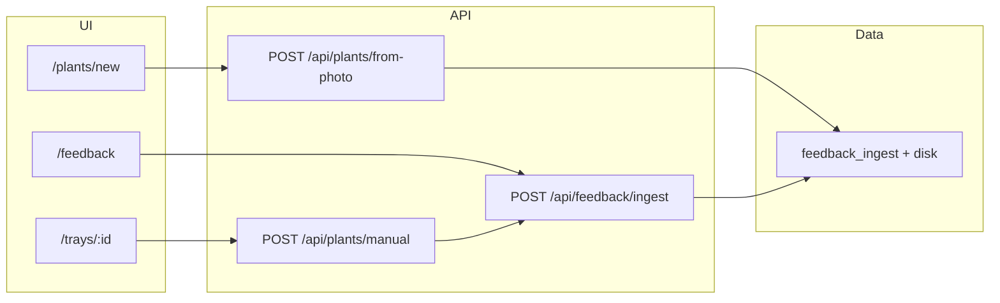

# Image Feedback and Reclassification

This document describes the **human-in-the-loop** capture of user images and corrective labels in AgriHome: why it exists, how operators use it, how the backend stores it, how it ties into add-plant flows, and how offline jobs can export data for model training and retraining gates.

---

## 1. Description

**Image feedback** is the ability to upload an image together with structured and free-text signals: a **corrected category** (e.g. disease or condition), **tags**, **comments**, and optionally what the **model had predicted** before the user’s correction. Those rows are stored in PostgreSQL and the raw file on the application server under configurable storage, exposed via a stable URL.

**Reclassification** in this product sense means: the user (or a trusted backend) asserts a **ground-truth or preferred label** that may differ from the classifier or report the app showed—either explicitly in the `feedback_category` field or in tags/comment. The `model_prediction_label` field records what the system believed at submission time (truncated for display/storage), so ML engineers can measure disagreement and build better training sets.

The standalone **Feedback** page and the **integrated add-plant paths** (photo-first and manual-with-optional training photo) all feed the same `feedback_ingest` table and the same on-disk layout for images.

---

## 2. Reasoning

- **Model improvement** — Classifiers and health pipelines are never perfect. Capturing “this photo should be labeled X” (and the image itself) is the standard way to build supervised datasets for retraining, domain adaptation, and error analysis.
- **Traceability** — Storing `user_uid`, `owner_email`, timestamps, and optional `model_prediction_label` links corrections to both identity and a snapshot of model output.
- **Operational simplicity** — For current deployments, images stay **on the server** (no mandatory object store). Exports and training scripts can read files from disk or pull the same image via the app’s public base URL for HTTP-based tooling.
- **User experience** — Feedback is **optional** and can be offered **in context** (same leaf photo as add-plant) so users do not need a separate “feedback tool” unless they want the dedicated page.

---

## 3. User Flows

### 3.1 Standalone feedback (`/feedback`)

1. User signs in and opens **Feedback** from the shell navigation.
2. They drag in or pick an image (JPEG, PNG, or WebP; size limit configurable, default 8MB).
3. They provide at least one of: **category** (dropdown), **tags** (comma-separated or JSON array), or **comment** (minimum three characters for free-text-only submissions).
4. Optionally they fill **model prediction** (what the app showed before their correction).
5. Submit sends `POST /api/feedback/ingest` (multipart: field `image` plus form fields). Success and errors are shown inline.

### 3.2 Photo add plant with optional training feedback (`/plants/new`)

1. User selects a tray and may fill **optional** training fields: crop/plant name, condition, tags, comment **before** uploading the same leaf photo used for species and health analysis.
2. The client sends one multipart request to `POST /api/plants/from-photo` including `trainingFeedbackCrop`, `trainingFeedbackCategory`, `trainingTags`, `trainingComment` when any are set. If crop is omitted, the server uses the detected species name for `feedback_crop` when saving feedback.
3. The server runs the existing pipeline (species detection, plant creation, capture, health report) **then**, if the user provided any qualifying training text, **persists a second copy** of the image to the feedback storage path and inserts a `feedback_ingest` row with an auto-generated `**model_prediction_label`** summarizing species, confidence, and report diagnosis (shortened to 120 characters). Plant creation is **not** rolled back if feedback persistence fails; the client may show a warning.

### 3.3 Manual add plant with optional training photo (tray page)

1. On a tray, the user completes **Add plant manually** (name, cultivar, layout, health, etc.).
2. In **Optional — training photo**, they may attach a different image and crop name, condition, tags, or comment. If a file is present, the same “at least one of crop + condition, condition, tags, or comment (3+ chars)” rule applies as on the Feedback page.
3. After `POST /api/plants/manual` succeeds, the client calls `POST /api/feedback/ingest` with the training image, optional `feedbackCrop`, and `model_prediction` set to `name / cultivar` of the plant just created.
4. Clear success or combined error messages are shown; rate limits apply separately to the feedback endpoint.

---

## 4. Backend and Architecture

### 4.1 Layered structure

| Layer                              | Responsibility                                                                                                                                                                                                                                                                                                                                                                                                                                               |
| ---------------------------------- | ------------------------------------------------------------------------------------------------------------------------------------------------------------------------------------------------------------------------------------------------------------------------------------------------------------------------------------------------------------------------------------------------------------------------------------------------------------ |
| **Route handlers**                 | `src/app/api/feedback/ingest/route.ts` — auth, rate limits, multipart parse. `from-photo` and client-side second POST for manual path invoke shared helpers.                                                                                                                                                                                                                                                                                                 |
| **Domain helper**                  | `src/lib/feedback/training-sample.ts` — `parseTrainingFeedbackTags`, `trainingFeedbackFieldsPresent`, `recordTrainingFeedbackSample` (validate, save under `originals/feedback/...` with a stable `fb-...` filename, insert row).                                                                                                                                                                                                                            |
| **PlantVillage layout (optional)** | `src/lib/feedback/plantvillage-dataset-export.ts` — if `PLANTVILLAGE_FEEDBACK_DATASET_DIR` is set, a second copy is written as `<ClassFolder>/<feedbackId>.<ext>` (ImageFolder style; see [PlantVillage `raw/color](https://github.com/spMohanty/PlantVillage-Dataset/tree/master/raw/color)`). Optional `PLANTVILLAGE_FEEDBACK_FOLDER_MAP` JSON maps UI labels to class folder names. The DB stores `plantvillage_dataset_relpath` when a copy was written. |
| **Persistence**                    | `src/lib/services/feedback-ingest-service.ts` — `insertFeedbackIngest` with `INSERT ... RETURNING`.                                                                                                                                                                                                                                                                                                                                                          |
| **Storage**                        | `src/lib/storage/save-feedback-image.ts` — writes under `getOriginalsRoot()` at `feedback/YYYY/MM/DD/<fb-id>.<ext>`; public path `/api/files/originals/feedback/...`.                                                                                                                                                                                                                                                                                        |
| **File serving**                   | `src/app/api/files/[...path]/route.ts` — authenticated GET for `originals` tree (includes `feedback/...`).                                                                                                                                                                                                                                                                                                                                                   |
| **Rate limiting**                  | `src/lib/api/rate-limit-memory.ts` — in-process sliding window (per IP and per user on ingest); not suitable for multi-instance without a shared store.                                                                                                                                                                                                                                                                                                      |
| **Plant integration**              | `src/lib/services/plant-manual-service.ts` — `createPlantFromPhotoWithAutoDetection` accepts optional `trainingFeedback` and calls `recordTrainingFeedbackSample` after analysis.                                                                                                                                                                                                                                                                            |

### 4.2 Database: `feedback_ingest`

Defined in `db/migrations/005_feedback_ingest.sql` and mirrored in `db/schema.sql`.

| Column                           | Role                                                                                                                                                                                              |
| -------------------------------- | ------------------------------------------------------------------------------------------------------------------------------------------------------------------------------------------------- |
| `id`                             | Primary key, client/server generated (`fb-...`).                                                                                                                                                  |
| `user_uid`                       | Firebase UID.                                                                                                                                                                                     |
| `owner_email`                    | Normalized account email.                                                                                                                                                                         |
| `image_url`                      | App-relative or absolute URL to the image.                                                                                                                                                        |
| `image_storage_provider`         | `local` (S3 was removed; legacy rows may still show other values in old DBs).                                                                                                                     |
| `image_storage_key`              | Relative path under originals root, e.g. `feedback/2026/04/28/uuid.jpg`.                                                                                                                          |
| `image_mime_type`, `image_bytes` | Audit and export sizing.                                                                                                                                                                          |
| `feedback_category`              | User-selected or asserted condition (e.g. Early blight).                                                                                                                                          |
| `feedback_crop`                  | Crop or plant name (e.g. Tomato); with category, used for `Crop___Condition` dataset folders.                                                                                                    |
| `feedback_tags`                  | JSON array of strings.                                                                                                                                                                            |
| `comment_text`                   | Free text.                                                                                                                                                                                        |
| `model_prediction_label`         | What the model/UI suggested (reclassification target vs source).                                                                                                                                  |
| `created_at`                     | Submission time.                                                                                                                                                                                  |
| `export_batch_id`, `exported_at` | Filled by the export script when a row is included in an ML batch.                                                                                                                                |
| `plantvillage_dataset_relpath`   | When `PLANTVILLAGE_FEEDBACK_DATASET_DIR` is set, the relative path under that root to the training copy, e.g. `Tomato___Early_blight/fb-....jpg`. `NULL` if the env is unset or the write failed. |

Indexes support listing by user/time and **pending export** (rows with `exported_at IS NULL`).

### 4.3 API: `POST /api/feedback/ingest`

- **Content-Type:** `multipart/form-data`
- **Fields:** `image` (file, required), `feedbackCrop` (name), `feedbackCategory`, `tags`, `comment`, `modelPrediction` (optional individually; at least one of crop+category, category, tags, or comment must satisfy `trainingFeedbackFieldsPresent`).
- **Auth:** Session cookie (Firebase) for interactive users, or `X-Agrihome-Feedback-Key` plus `userUid` / `userEmail` form fields when `FEEDBACK_INGEST_SERVICE_KEY` is set for trusted integrations.
- **Limits:** `FEEDBACK_MAX_IMAGE_BYTES` (default 8MB), per-user and per-IP request windows (`FEEDBACK_INGEST_MAX_PER_USER_PER_MIN`, `FEEDBACK_INGEST_MAX_PER_IP_PER_MIN`).

**Responses:** JSON `{ data: { id, imageUrl, createdAt, ... } }` on success; `4xx/5xx` with `{ error }` on failure.

### 4.4 Shared UI constants

`src/lib/constants/training-feedback-ui.ts` — category dropdown options reused on Feedback, Add plant, and tray manual flow for consistency.

---

## 5. ML Export and Reclassification in Training Pipelines

### 5.0 Layout vs `cv-backend/train.py`

Training in this repo uses `**torchvision.datasets.folder`–style trees**: the directory you pass as `--data-dir` is a single **ImageFolder root** whose **immediate subdirectories are class names**, each containing image files. That matches PlantVillage’s `**raw/color`** folder, not the parent `**raw/**` directory (which would make `color`, `grayscale`, and `segmented` look like class labels). `train.py` explicitly errors if those three names appear as classes.

**AgriHome feedback export** follows the same rule: `PLANTVILLAGE_FEEDBACK_DATASET_DIR` should point to a root whose children are folders like `Tomato___Early_blight`, not an extra `color` level in between. Files are written as `<ClassFolder>/<fb-id>.<ext>` with extensions compatible with training (`train.py` uses torchvision’s image extensions).

To **merge** user feedback with the full PlantVillage run, use the same pattern as other external sets: e.g. `--extra-dataset agrihome=/path/to/feedback-root` and an `**agrihome`** mapping in `cv-backend/dataset_label_map.json` from your on-disk folder names to canonical `Crop___Condition` names (when you use `Agrihome___...` auto folders instead of mapping UI labels to PlantVillage names in `PLANTVILLAGE_FEEDBACK_FOLDER_MAP`).

### 5.1 Export script

- **Command:** `npm run ml:export-feedback` → `scripts/ml/export-feedback-dataset.cjs`
- **Behavior:** Selects up to a limit of rows with `exported_at IS NULL`, copies or downloads the image into `storage/ml-staging/batches/<batchId>/images/`, writes `**manifest.jsonl`** (one JSON object per line) with normalized text fields and optional `ML_LABEL_MAP_JSON` category mapping, then marks rows with `export_batch_id` and `exported_at`.
- **Image resolution order:** local file via `image_storage_key`, then HTTP GET for `/api/files/...` (needs `PUBLIC_API_BASE_URL` or `NEXT_PUBLIC_API_BASE_URL`), then any `http(s)` `image_url`.

### 5.2 Retrain gate (MLOps)

- **Command:** `npm run ml:retrain-gate` → `scripts/ml/retrain-gate.cjs`
- **Behavior:** Counts **pending** (not yet exported) feedback rows; if count ≥ `RETRAIN_FEEDBACK_THRESHOLD` (default 1000), posts JSON to `RETRAIN_WEBHOOK_URL` and optionally notifies `SLACK_WEBHOOK_URL` / `ML_SLACK_WEBHOOK_URL`.
- **CI:** `.github/workflows/ml-retrain-gate.yml` — scheduled and manual dispatch; requires secrets for Postgres and optional webhooks.

Reclassification data consumed downstream is the combination of **image file** + **manifest fields** (`feedback_category_label`, `tags`, `comment`, etc., depending on how the script maps raw columns).

---

## 6. Environment Variables (Summary)

| Variable                                            | Purpose                                                                                                       |
| --------------------------------------------------- | ------------------------------------------------------------------------------------------------------------- |
| `FEEDBACK_MAX_IMAGE_BYTES`                          | Max upload size for ingest.                                                                                   |
| `FEEDBACK_INGEST_MAX_PER_USER_PER_MIN`              | Rate limit per Firebase UID.                                                                                  |
| `FEEDBACK_INGEST_MAX_PER_IP_PER_MIN`                | Rate limit per client IP.                                                                                     |
| `FEEDBACK_INGEST_SERVICE_KEY`                       | Shared secret for server-to-server ingest.                                                                    |
| `STORAGE_ROOT`, `STORAGE_ORIGINALS_DIR`             | Where `feedback/...` files live.                                                                              |
| `PLANTVILLAGE_FEEDBACK_DATASET_DIR`                 | ImageFolder root (same idea as PlantVillage `raw/color`) for an optional on-disk class-folder copy; see §5.0. |
| `PLANTVILLAGE_FEEDBACK_FOLDER_MAP`                  | JSON object mapping exact UI label strings to `Crop___Condition` folder names.                                |
| `PUBLIC_API_BASE_URL` / `NEXT_PUBLIC_API_BASE_URL`  | Base URL for export script to fetch `/api/files/...` images.                                                  |
| `ML_STAGING_DIR`                                    | Where batch folders and `manifest.jsonl` are written.                                                         |
| `ML_LABEL_MAP_JSON`                                 | Map human-readable categories to model label IDs in export.                                                   |
| `RETRAIN_FEEDBACK_THRESHOLD`, `RETRAIN_WEBHOOK_URL` | MLOps gate.                                                                                                   |
| `ML_SLACK_WEBHOOK_URL`                              | Alerts for threshold or failures.                                                                             |

See `**.env.example`** for the full list and comments.

---

## 7. Operations

- **Apply migration:** `npm run db:migrate` (includes `005_feedback_ingest.sql`, `006_feedback_plantvillage_path.sql`, and later files when present).
- **Backups:** Include PostgreSQL and the on-disk tree under your configured originals path (`feedback/` subtree).
- **Multi-instance note:** In-memory rate limits and local disk assume a single app instance or shared filesystem; use Redis and shared storage for horizontal scale.

---

## 8. Security and Privacy

- Feedback is tied to **authenticated users** in normal use; do not log raw tokens.
- `FEEDBACK_INGEST_SERVICE_KEY` should be long, random, and rotated like any API secret; restrict callers to your integration network.
- Images may contain PII in frame; handle exports and training artifacts under your **data processing** policy (retention, region, DSR).

---

## 9. Related Files (Quick index)

| Path                                                      | Note                                                                              |
| --------------------------------------------------------- | --------------------------------------------------------------------------------- |
| `src/app/api/feedback/ingest/route.ts`                    | Ingest API                                                                        |
| `src/lib/feedback/training-sample.ts`                     | Core insert helper                                                                |
| `src/app/api/plants/from-photo/route.ts`                  | Optional training form fields                                                     |
| `src/lib/services/plant-manual-service.ts`                | `createPlantFromPhotoWithAutoDetection` + feedback                                |
| `src/app/(protected)/feedback/`                           | Standalone page                                                                   |
| `src/app/(protected)/plants/new/NewPlantClient.tsx`       | Optional training block                                                           |
| `src/app/(protected)/trays/[trayId]/TrayManageClient.tsx` | Optional training photo after manual add                                          |
| `scripts/ml/export-feedback-dataset.cjs`                  | Export                                                                            |
| `scripts/ml/retrain-gate.cjs`                             | Threshold + webhook + Slack                                                       |
| `db/migrations/005_feedback_ingest.sql`                   | Base `feedback_ingest` table                                                      |
| `db/migrations/006_feedback_plantvillage_path.sql`        | `plantvillage_dataset_relpath`                                                    |
| `cv-backend/train.py`                                     | ImageFolder training; `--data-dir` = `raw/color` layout                           |
| `cv-backend/dataset_label_map.json`                       | Maps extra dataset folder names → PlantVillage-style labels for `--extra-dataset` |

---

## 10. Future Extensions (not implemented)

- Pluggable object storage, virus scanning, async thumbnail generation, admin review queues, per-tenant quotas, and GraphQL types for `feedback_ingest` are natural next steps as usage grows.

For broader platform architecture, see [docs/IMPLEMENTATION_GUIDE.md](./IMPLEMENTATION_GUIDE.md) and [docs/diagrams/01-architecture.md](./diagrams/01-architecture.md).