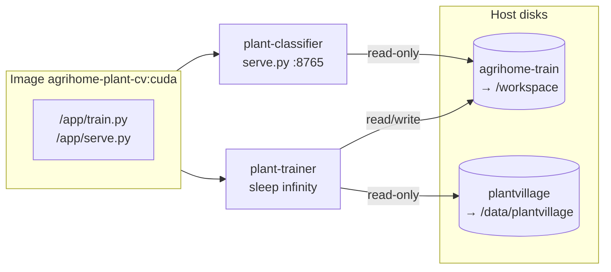

# Plant trainer and plant classifier (Docker GPU services)

This document describes the two companion services in [`docker-compose.full-stack.yml`](../docker-compose.full-stack.yml): **`plant-trainer`** and **`plant-classifier`**. Both use the same image (**`agrihome-plant-cv:cuda`**) built from **`cv-backend/Dockerfile.cuda`**, but they run different commands and mounts for different jobs.

For how AgriHome calls the classifier from Next.js, see [CV_PIPELINE.md](./CV_PIPELINE.md).

---

## Roles at a glance

| Service | Purpose | Typical command | GPU | Workspace mount |
|--------|---------|-----------------|-----|------------------|
| **`plant-trainer`** | Interactive training: run **`train.py`** when you `docker exec` in | `sleep infinity` (idle until you exec) | Yes | **Read/write** — writes `artifacts/best.pt`, `artifacts/classes.json` |
| **`plant-classifier`** | Production inference: **`serve.py`** FastAPI for leaf photos | `python /app/serve.py --checkpoint … --classes …` | Yes | **Read-only** — loads weights + class list from the same host folder |

**Important:** Training and serving must use **`best.pt` and `classes.json` from the same training run**. The server refuses to start if the number of names in `classes.json` does not match the checkpoint’s final layer size.

---

## What gets built

- **Build context:** directory that contains **`Dockerfile.cuda`**, **`train.py`**, **`serve.py`**, **`requirements-docker-cuda.txt`** (in the repo this is **`cv-backend/`**).
- **Base image:** `pytorch/pytorch:2.5.1-cuda12.4-cudnn9-runtime` by default (overridable via `ARG PYTORCH_IMAGE` in `Dockerfile.cuda`). Pick a tag that matches your **NVIDIA driver** and CUDA stack.
- **Image name:** `agrihome-plant-cv:cuda` (local build; not pulled from a registry unless you tag and push it yourself).

If Compose cannot find the build context, it may try to **pull** `agrihome-plant-cv:cuda` and fail with “pull access denied”. Fix by cloning the full repo or setting:

```env
AGRIHOME_CV_BACKEND=/absolute/path/to/agrihome/cv-backend
```

next to your compose file, then:

```bash
docker compose -f docker-compose.full-stack.yml build plant-trainer plant-classifier
```

---

## Host prerequisites

1. **NVIDIA driver** installed on the host.
2. **[NVIDIA Container Toolkit](https://docs.nvidia.com/datacenter/cloud-native/container-toolkit/install-guide.html)** so Docker can pass GPUs into containers.
3. **PlantVillage** (or compatible **`ImageFolder`**) dataset on the host, with **`raw/color`** as the training root — folders named like **`Tomato___healthy`**, **`Squash___Powdery_mildew`**, not only **`color` / `grayscale` / `segmented`**. See [CV_PIPELINE.md](./CV_PIPELINE.md#plantvillage-dataset).
4. A **writable training workspace** on the host (example paths from compose):
   - **`/mnt/mainpool/apps/agrihome-train`** → mounted as **`/workspace`** in both services.
5. Dataset mount (read-only for trainer):
   - **`/mnt/mainpool/datasets/plantvillage`** → **`/data/plantvillage`** in **`plant-trainer`** only.

Adjust these paths in `docker-compose.full-stack.yml` if your NAS layout differs.

Suggested layout on disk:

```text
/mnt/mainpool/apps/agrihome-train/    # workspace (artifacts + optional scripts)
  artifacts/
    best.pt
    classes.json
/mnt/mainpool/datasets/plantvillage/  # often a symlink or clone of raw/color content
  Apple___Apple_scab/
  ...
```

---

## Service: `plant-trainer`

### Why it exists

Training is **not** run automatically at container start. The container stays alive with **`sleep infinity`** so you can **`docker exec`** (or `docker compose exec`) and run **`python train.py`** with the right **`--data-dir`**, epochs, and batch size for your GPU.

### Compose defaults (reference)

- **Container name:** `plant-trainer`
- **`working_dir`:** `/workspace` (host: `agrihome-train`)
- **`command`:** `sleep infinity`
- **Volumes:**
  - `agrihome-train:/workspace` (read/write)
  - `plantvillage:/data/plantvillage:ro`
- **`gpus`:** one GPU, `compute,utility`
- **Environment:** `NVIDIA_VISIBLE_DEVICES=0` (change index if you have multiple GPUs)

### Running a training job

```bash
docker compose -f docker-compose.full-stack.yml up -d plant-trainer
docker compose -f docker-compose.full-stack.yml exec plant-trainer bash
```

Inside the container:

```bash
cd /workspace
python /app/train.py \
  --data-dir /data/plantvillage \
  --epochs 20 \
  --batch-size 64 \
  --output-dir ./artifacts
```

Notes:

- **`--data-dir`** must point at the **`raw/color`**-style tree (class subfolders). **`train.py`** exits with an error if it detects split-folder class names `color`, `grayscale`, or `segmented`.
- Outputs are written under **`/workspace/artifacts/`** → on the host, **`…/agrihome-train/artifacts/`**:
  - **`best.pt`** — model weights (validation accuracy checkpoint)
  - **`classes.json`** — class names in **training order** (must match the checkpoint)

Tune **`--batch-size`** if you hit GPU OOM; use **`--num-workers`** if DataLoader is slow (see `train.py --help`).

### After training

1. Confirm **`artifacts/best.pt`** and **`artifacts/classes.json`** exist on the host.
2. **Restart `plant-classifier`** so it reloads the new files (inference loads artifacts **once at startup**).

---

## Service: `plant-classifier`

### Why it exists

It exposes the **HTTP API** AgriHome uses as **`CV_SPECIES_INFERENCE_URL`**: **`POST /v1/classify`** with a base64 image, returning crop/condition fields parsed from PlantVillage-style labels.

### Compose defaults (reference)

- **Container name:** `plant-classifier`
- **`working_dir`:** `/app` (code copied into the image)
- **Command:**  
  `python /app/serve.py --checkpoint /workspace/artifacts/best.pt --classes /workspace/artifacts/classes.json --host 0.0.0.0 --port 8765`
- **Volumes:**
  - `agrihome-train:/workspace:ro` — **read-only** so inference cannot overwrite artifacts by mistake
- **Ports:** `8765:8765` (map host port as needed, e.g. `8754:8765`)
- **Environment:**
  - `USE_CLAHE=0` by default; set to **`1`** for optional LAB CLAHE before the CNN (see `serve.py`)
- **GPU:** same pattern as trainer (inference uses CUDA when available)

### HTTP endpoints

| Method | Path | Description |
|--------|------|-------------|
| **GET** | `/health` | Liveness + **what the process actually loaded**: `num_classes`, `first_class`, `last_class`, `classes_file`, `checkpoint`, `class_preview` |
| **POST** | `/v1/classify` | Body: `{ "imageBase64": "<JPEG/PNG as base64>" }`. Returns `commonName`, `cultivar`, `plantCondition`, `rawLabel`, `isHealthy`, `identificationConfidence` |

Empty or invalid `imageBase64` returns **400** with a clear message (not 500).

### Startup validation (`serve.py`)

- Rejects **`classes.json`** that still lists PlantVillage **split** folders (`color`, `grayscale`, `segmented`) as class names.
- Requires **`len(classes.json) ==`** the checkpoint **`fc` output size** so a 3-class model cannot be paired with a 38-line JSON (or vice versa).

### Publishing to the LAN

Inside Docker **Compose**, the **`agrihome`** app typically uses the **internal** URL:

```env
CV_SPECIES_INFERENCE_URL=http://plant-classifier:8765/v1/classify
```

From your **laptop** or browser hitting the host IP, use the **published** host port and **always** include the path **`/v1/classify`**:

```env
CV_SPECIES_INFERENCE_URL=http://192.168.0.142:8754/v1/classify
```

if compose has `ports: ["8754:8765"]`.

### Reloading a new model

`serve.py` reads **`classes.json` and the checkpoint only at process start**. After replacing **`best.pt`** / **`classes.json`** on the host:

```bash
docker compose -f docker-compose.full-stack.yml restart plant-classifier
```

Then verify:

```bash
curl -s http://<host>:<published-port>/health
```

You should see **`first_class`** matching the first entry in your **`classes.json`** and **`num_classes`** equal to your class count (e.g. 38 for full PlantVillage color).

---

## How the two services share one image



---

## Troubleshooting

| Symptom | Likely cause | What to do |
|--------|----------------|------------|
| **`/health` shows 3 classes** or **`first_class": "color"`** | Old **`classes.json`** still loaded, or wrong **`artifacts`**; or you are curling a **different** host/port | Restart **`plant-classifier`**; confirm **`curl` URL** matches **`CV_SPECIES_INFERENCE_URL`**; check **`/health`** `classes_file` path |
| **`pull access denied`** for `agrihome-plant-cv:cuda` | Build context missing | Set **`AGRIHOME_CV_BACKEND`**, run **`docker compose build`** |
| Container exits on start | **`classes.json` vs `best.pt` mismatch** or invalid split-folder JSON | Fix artifacts pair; read **`docker logs plant-classifier`** |
| AgriHome errors on classify | URL missing **`/v1/classify`**, or firewall | Use full URL; test with **`curl`** from the same machine as Next.js |
| Training very slow | CPU instead of GPU | Run **`nvidia-smi`** inside **`plant-trainer`**; check **`gpus:`** in compose |

---

## Related files

| File | Role |
|------|------|
| [`docker-compose.full-stack.yml`](../docker-compose.full-stack.yml) | Service definitions, volumes, ports |
| [`cv-backend/Dockerfile.cuda`](../cv-backend/Dockerfile.cuda) | GPU image build |
| [`cv-backend/train.py`](../cv-backend/train.py) | Training CLI and dataset checks |
| [`cv-backend/serve.py`](../cv-backend/serve.py) | FastAPI inference and validation |
| [`cv-backend/requirements-docker-cuda.txt`](../cv-backend/requirements-docker-cuda.txt) | Pip deps on top of PyTorch base image |
| [`docs/CV_PIPELINE.md`](./CV_PIPELINE.md) | End-to-end CV ↔ AgriHome integration |

For a shorter local-venv workflow (no Docker), see [`cv-backend/README.md`](../cv-backend/README.md).
