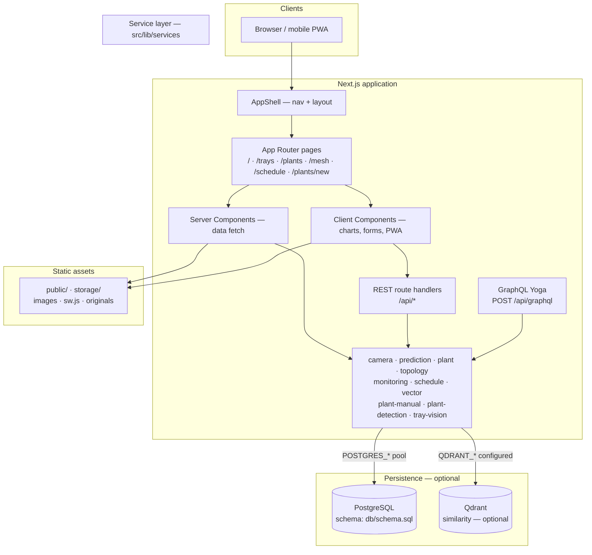

# Architecture diagram

High-level view of the AgriHome Vision Console: Next.js full-stack app, service layer, PostgreSQL, and optional Qdrant / CV HTTP services.

## Data path

| Component | Role |
|-----------|------|
| **PostgreSQL** | Canonical trays, plants, captures, predictions, reports, events, meshes, schedules (`db/schema.sql`) |
| **Disk storage** | Optional `STORAGE_*` roots; images served via `GET /api/files/...` |
| **Qdrant** | Optional similarity search when `QDRANT_URL` is set |

## Build output

- `output: "standalone"` in `next.config.ts` for container images.
- After `npm run build`, `postbuild` copies `.next/static` and `public` into `.next/standalone` for a runnable bundle.
