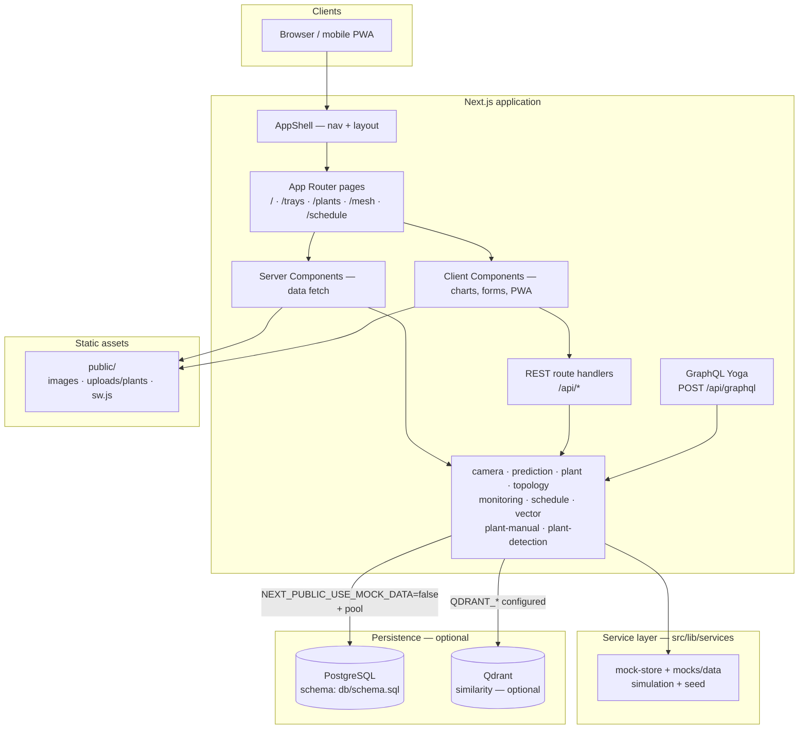

# Architecture diagram

High-level view of the AgriHome Vision Console: Next.js full-stack app, service layer, and dual data paths (mock vs PostgreSQL).

## Runtime modes

| Mode | Data source |
|------|-------------|
| **Mock (default)** | In-memory `mock-store` seeded from `createMockSeed()` |
| **Live DB** | `NEXT_PUBLIC_USE_MOCK_DATA=false` and `POSTGRES_*` set → SQL queries; failures fall back to mock |

## Build output

- `output: "standalone"` in `next.config.ts` for container images.
- After `npm run build`, `postbuild` copies `.next/static` and `public` into `.next/standalone` for a runnable bundle.
