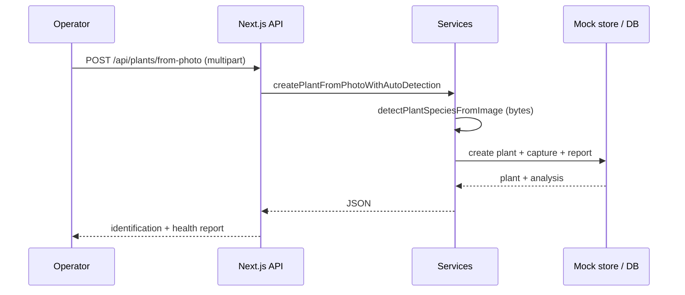

# Integration diagram

Boundaries between the dashboard, persistence, and future / external systems.

```mermaid
flowchart LR
  subgraph operator [Operator]
    U[User / grower]
  end

  subgraph agrihome [AgriHome Vision Console]
    UI[Next.js UI + REST + GraphQL]
  end

  subgraph data [Configured backends]
    PG[(PostgreSQL)]
    Q[(Qdrant)]
  end

  subgraph future [Planned / external]
    Edge[Edge camera devices]
    CV[Computer vision / ML service]
    Obj[Object storage for frames]
  end

  U --> UI
  UI --> PG
  UI --> Q
  Edge -.->|"POST /api/camera/ingest\n(image URL or ref)"-.-> UI
  UI -.->|"schedules.destination\n→ future CV backend"-.-> CV
  Edge -.-> Obj
  CV -.-> Obj
```

## Integration summary

| System | Role today | Protocol / notes |
|--------|------------|------------------|
| **PostgreSQL** | Canonical trays, plants, captures, predictions, reports, events, meshes, schedules | `pg` pool; env `POSTGRES_*` |
| **Qdrant** | Optional vector similarity for “reference” matches | REST client; env `QDRANT_*`; often mocked |
| **Browser** | SPA + PWA (`PwaProvider`, `sw.js`) | HTTPS in production |
| **File uploads** | User plant photos → `public/uploads/plants/` | Multipart `POST /api/plants/from-photo` |
| **Edge cameras** | Not shipped; ingest contract via JSON body | `POST /api/camera/ingest` |
| **Real ML** | Simulated: `derivePredictionFromCapture`, `detectPlantSpeciesFromImage` | Replace service internals |


