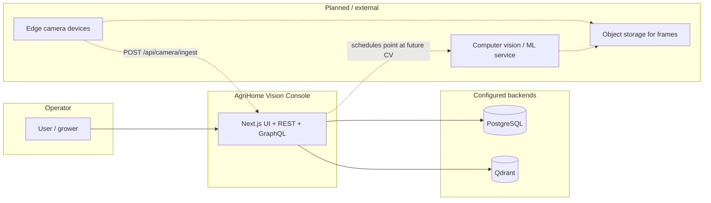
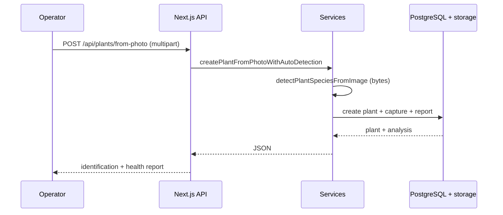

# Integration diagram

Boundaries between the dashboard, persistence, and future / external systems.

## Integration summary

| System | Role today | Protocol / notes |
|--------|------------|------------------|
| **PostgreSQL** | Canonical trays, plants, captures, predictions, reports, events, meshes, schedules | `pg` pool; env `POSTGRES_*` (required) |
| **Qdrant** | Optional vector similarity for “reference” matches | REST client; env `QDRANT_*` |
| **Browser** | SPA + PWA (`PwaProvider`, `sw.js`) | HTTPS in production |
| **File uploads** | User plant photos → configurable `STORAGE_*` paths; URLs often under `/api/files/...` | Multipart `POST /api/plants/from-photo`, `POST /api/plants/{id}/photo`, tray `POST /api/trays/{id}/vision` |
| **Edge cameras** | Not shipped; ingest contract via JSON body | `POST /api/camera/ingest` |
| **CV HTTP** | Optional `CV_TRAY_INFERENCE_URL`, `CV_SPECIES_INFERENCE_URL` | Species path requires configured URL; tray path can use simulator when unset |

