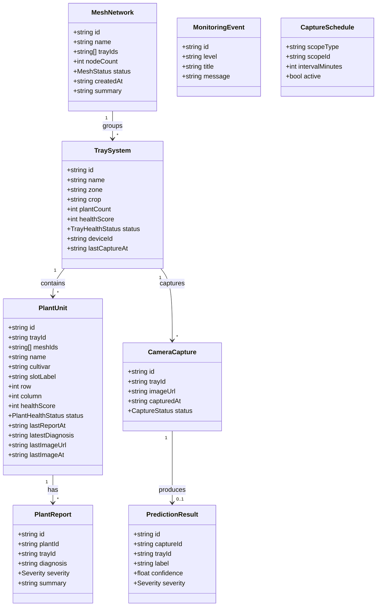
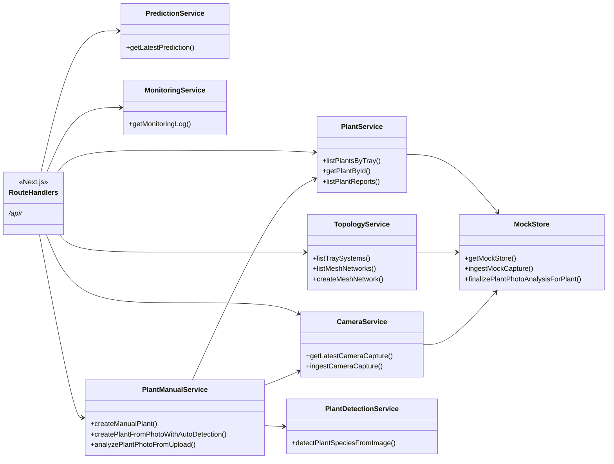

# UML-style diagrams (Mermaid)

## Domain model (conceptual)

Core types from `src/lib/types/domain.ts` and their relationships.

## Service layer (simplified)

How route handlers depend on services (not every import shown).

