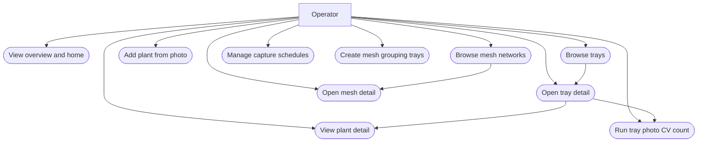
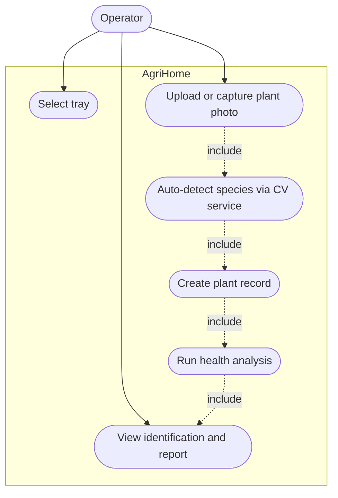
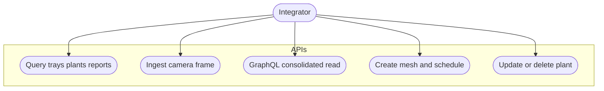

# Use case diagrams

Operator (grower / facility user) interacting with the Vision Console.

## Primary use cases

## Use case — add plant with auto-identification

Equivalent to a classic use-case diagram: the operator selects a tray and uploads a photo; inner steps chain as include-style dependencies.

## Use case — integrator (API and GraphQL)

## Mapping to routes (operator UI)

| Use case | Typical route |
|----------|----------------|
| Overview | `/` |
| Tray list | `/trays` |
| Tray detail | `/trays/[trayId]` |
| Plant detail | `/plants/[plantId]` |
| Add plant (photo-first) | `/plants/new` |
| Mesh list / create | `/mesh` |
| Mesh detail | `/mesh/[meshId]` |
| Schedules | `/schedule` |
| Tray CV photo | `/trays/[trayId]` (vision upload / analysis UI) |
