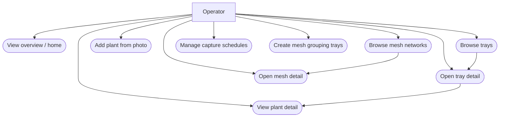

# Use case diagrams

Operator (grower / facility user) interacting with the Vision Console.

## Primary use cases



## Use case — add plant with auto-identification

```mermaid
usecaseDiagram
  actor Operator
  package "AgriHome" {
    usecase "Select tray" as UC_T
    usecase "Upload / capture plant photo" as UC_P
    usecase "Auto-detect species (simulated)" as UC_D
    usecase "Create plant record" as UC_C
    usecase "Run health analysis" as UC_H
    usecase "View identification + report" as UC_V
  }
  Operator --> UC_T
  Operator --> UC_P
  UC_P ..> UC_D : <<include>>
  UC_D ..> UC_C : <<include>>
  UC_C ..> UC_H : <<include>>
  Operator --> UC_V
  UC_H ..> UC_V : <<include>>
```

## Use case — integrator (API / GraphQL)

```mermaid
usecaseDiagram
  actor Integrator
  package "APIs" {
    usecase "Query trays, plants, reports" as Q1
    usecase "Ingest camera frame" as Q2
    usecase "GraphQL consolidated read" as Q3
    usecase "Create mesh / schedule" as Q4
  }
  Integrator --> Q1
  Integrator --> Q2
  Integrator --> Q3
  Integrator --> Q4
```

## Mapping to routes (operator UI)

| Use case | Typical route |
|----------|----------------|
| Overview | `/` |
| Tray list | `/trays` |
| Tray detail | `/trays/[trayId]` |
| Plant detail | `/plants/[plantId]` |
| Add plant (photo-first) | `/plants/new` |
| Mesh list / create | `/mesh` |
| Mesh detail | `/mesh/[meshId]` |
| Schedules | `/schedule` |
