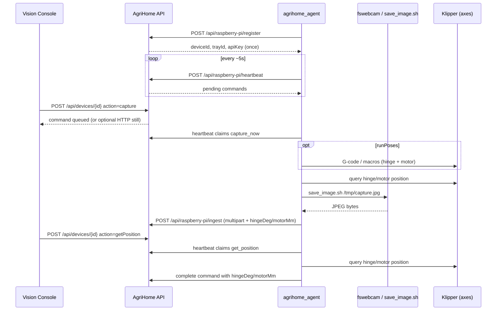

# Raspberry Pi + Klipper ↔ AgriHome

Connect bench Raspberry Pi devices running
[Agri-Home/klipper](https://github.com/Agri-Home/klipper) to AgriHome for
auto-provisioning, secure image ingest, and Take Picture / scheduled capture.

**Capture path:** the Pi agent grabs frames with **fswebcam** via
`camera-macros/save_image.sh` in the Klipper fork (not an HTTP webcam API).
Optional HTTP streamer URLs remain supported for a server-side Take Picture
fast path when a LAN still endpoint exists.

The reference agent lives in the same repo under `agrihome_agent/`
([Agri-Home/klipper](https://github.com/Agri-Home/klipper) branch
`feature/agrihome-agent`). Clone **klipper only** — you do not need Moonraker
to register or run the agent.

## What “connected” means

1. **Register** — Pi sends CPU serial (+ MAC / hostname); AgriHome creates an
   `edge_devices` row, hashed API key, and a linked tray.
2. **Heartbeat** — agent reports online; Vision Console shows status and claims
   pending commands.
3. **Take picture** — Vision Console queues `capture_now` (or optionally pulls
   an HTTP streamer still if `klipper_url` is set and reachable). The agent
   reads the live hinge/motor pose, runs `save_image.sh` / fswebcam, and
   `POST`s multipart ingest with that pose. AgriHome stores the values on the
   capture and upserts the plant's pose sequence entry.
4. **Get position** — Vision Console queues `get_position`; the agent queries
   local Moonraker (`http://127.0.0.1:7125` by default, or
   `AGRIHOME_MOONRAKER_URL`) and maps **`toolhead.position` X/Y** to
   `{ hingeDeg, motorMm }` (fallbacks: `gcode_move`, then optional
   `manual_stepper HINGE`/`MOTOR`). With a plant selected, the UI also saves
   that pose for the plant. The Vision Console **Streamer URL** (`klipper_url`)
   is an optional HTTP webcam still endpoint — it is **not** used for Moonraker
   `/printer/objects/query`.
5. **Poses / schedules** — pose walks and `destination: raspberry-pi-edge`
   schedules still enqueue commands the agent executes.



## AgriHome setup

```bash
# .env
DEVICE_PROVISIONING_SECRET=long-random-secret
DEVICE_DEFAULT_OWNER_EMAIL=you@example.com
# optional
DEVICE_AUTO_VISION_ON_INGEST=false
DEVICE_AUTO_DISEASE_ON_INGEST=true
DEVICE_HEARTBEAT_STALE_MINUTES=5
# Optional server-side HTTP still (only if you expose a streamer on the LAN)
# AGRIHOME_SNAPSHOT_PATH=/webcam/?action=snapshot
# DEVICE_SNAPSHOT_TIMEOUT_MS=8000

npm run db:migrate   # includes 012_klipper_url (moonraker_url → klipper_url)
npm run dev
```

## Register a device

### Option A — agent one-shot (recommended)

On the Pi (with Klipper + `fswebcam` installed):

```bash
cd /home/pi
git clone git@github.com:Agri-Home/klipper.git
cd klipper
git checkout feature/agrihome-agent   # until merged to master
sudo apt-get install -y fswebcam

export PYTHONPATH=/home/pi/klipper:$PYTHONPATH
export AGRIHOME_URL=https://agrihome.example.com   # or http://LAN_IP:3000
export DEVICE_PROVISIONING_SECRET='same-as-server'
export AGRIHOME_OWNER_EMAIL=you@example.com
export AGRIHOME_SNAPSHOT_CMD=/home/pi/klipper/camera-macros/save_image.sh
# Optional: LAN HTTP streamer base for server-side Take Picture
# (Vision Console "Streamer URL" — webcam stills, NOT Moonraker)
# export KLIPPER_URL=http://192.168.1.50:8080
# Moonraker on the Pi (Get position / G-code). Default if unset:
# export AGRIHOME_MOONRAKER_URL=http://127.0.0.1:7125

python3 -m agrihome_agent register
python3 -m agrihome_agent run
```

Credentials land in `~/.config/agrihome/agent.json` (mode 600). The plaintext
API key is shown only there after registration.

Enable as a service (optional):

```bash
sudo cp /home/pi/klipper/agrihome_agent/systemd/agrihome-agent.service \
  /etc/systemd/system/
sudo systemctl daemon-reload
sudo systemctl enable --now agrihome-agent.service
```

Re-provision (rotate key, same CPU serial):

```bash
python3 -m agrihome_agent register --re-provision
```

### Option B — raw HTTP register

```bash
curl -sS -X POST "$AGRIHOME_URL/api/raspberry-pi/register" \
  -H 'Content-Type: application/json' \
  -d '{
    "cpuSerial": "'"$(awk -F: '/^Serial/{print $2}' /proc/cpuinfo | tr -d " ")"'",
    "provisioningCode": "'"$DEVICE_PROVISIONING_SECRET"'",
    "ownerEmail": "you@example.com",
    "hostname": "'"$(hostname)"'",
    "model": "raspberry-pi-klipper",
    "klipperUrl": "http://192.168.1.50"
  }'
```

Response (store `apiKey` once):

```json
{
  "data": {
    "deviceId": "edge-…",
    "trayId": "tray-…",
    "apiKey": "ahdev_…",
    "apiKeyPrefix": "ahdev_…",
    "ownerEmail": "you@example.com"
  }
}
```

Subsequent agent calls use header **`X-Agrihome-Device-Key: <apiKey>`**.

| Method | Path | Purpose |
| --- | --- | --- |
| POST | `/api/raspberry-pi/register` | Provision device + tray |
| POST | `/api/raspberry-pi/heartbeat` | Online + claim commands |
| GET | `/api/raspberry-pi/commands` | List pending |
| POST | `/api/raspberry-pi/commands` | claim / complete / fail |
| GET | `/api/raspberry-pi/poses` | Active pose sequence |
| GET | `/api/raspberry-pi/capture-plan` | Trays + schedules + poses |
| POST | `/api/raspberry-pi/ingest` | Multipart JPEG upload |

Register / heartbeat accept deprecated `moonrakerUrl` as an alias for
`klipperUrl`.

## Capture on the Pi (fswebcam)

`camera-macros/save_image.sh` **requires** an output path. It saves the JPEG on
the Pi and, by default, uploads to AgriHome ingest (disease detection runs on
the server when `DEVICE_AUTO_DISEASE_ON_INGEST` is enabled — default true).

```bash
# Smoke test capture only
/home/pi/klipper/camera-macros/save_image.sh /tmp/agrihome-test.jpg --no-upload
file /tmp/agrihome-test.jpg   # JPEG image data

# Capture → save on Pi → upload → disease detection on AgriHome
export PYTHONPATH=/home/pi/klipper:$PYTHONPATH
/home/pi/klipper/camera-macros/save_image.sh /home/pi/agrihome/captures/leaf.jpg
# or:
python3 -m agrihome_agent capture /home/pi/agrihome/captures/leaf.jpg
```

Agent env:

| Variable | Default | Purpose |
| --- | --- | --- |
| `AGRIHOME_URL` | — | AgriHome base URL |
| `DEVICE_PROVISIONING_SECRET` | — | Must match server |
| `AGRIHOME_OWNER_EMAIL` | — | Tray owner if server has no default |
| `KLIPPER_URL` | — | Optional LAN HTTP streamer stored as `klipper_url` (not Moonraker) |
| `AGRIHOME_MOONRAKER_URL` | `http://127.0.0.1:7125` | Moonraker control API for Get position / G-code |
| `AGRIHOME_SNAPSHOT_CMD` | — | Path to `save_image.sh` (preferred) |
| `AGRIHOME_SNAPSHOT_PATH` | — | Fallback HTTP still path/URL |
| `AGRIHOME_HEARTBEAT_SECONDS` | `5` | Poll / claim interval |
| `AGRIHOME_ACTUATOR_DRY_RUN` | `1` | Skip real G-code until macros ready |
| `AGRIHOME_STUB_HINGE_DEG` | — | Bench hinge pose without Moonraker |
| `AGRIHOME_STUB_MOTOR_MM` | — | Bench motor pose without Moonraker |

## Vision Console

1. **Devices** — confirm heartbeat **online**.
2. Tray → Raspberry Pi panel → **Take picture** (queues agent; optional
   streamer URL for immediate server pull).
3. **Generate poses from layout** then schedule with
   `destination: raspberry-pi-edge` for multi-angle runs.

Update optional streamer URL via UI (`action: updateKlipperUrl`) or SQL.
This field is for HTTP stills only — Get position uses Moonraker on the Pi
(`AGRIHOME_MOONRAKER_URL` / `http://127.0.0.1:7125`), reading
`toolhead.position` X→`hingeDeg` / Y→`motorMm`, not `klipper_url`.

```sql
UPDATE edge_devices
SET klipper_url = 'http://192.168.1.108:8080', updated_at = NOW()
WHERE id = 'edge-…';
```

## Security notes

See [EDGE_DEVICE_SECURITY.md](./EDGE_DEVICE_SECURITY.md). Do not expose the Pi
agent API key or an unauthenticated webcam stream to the public internet.

## Checklist

- [ ] `npm run db:migrate` applied (`012_klipper_url`)
- [ ] `DEVICE_PROVISIONING_SECRET` set on server and Pi
- [ ] Agri-Home/klipper installed; `save_image.sh` writes a JPEG
- [ ] Agent registered from the klipper clone; Devices page shows **online**
- [ ] Take picture → frame via agent ingest (and plant attach / disease hooks)
- [ ] Optional: LAN streamer URL for server-side fast path
