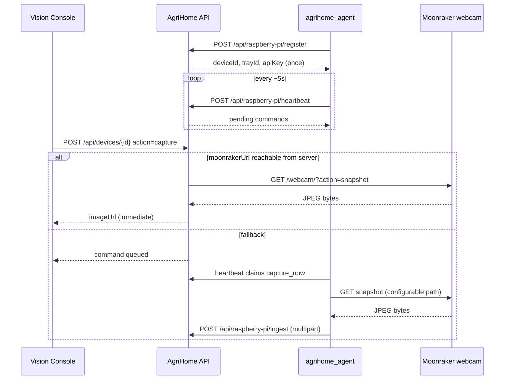

# Raspberry Pi + Moonraker ↔ AgriHome

Connect bench Raspberry Pi devices (Moonraker / Klipper capture rigs) to AgriHome
for auto-provisioning, secure image ingest, and Take Picture / scheduled capture.

Companion agent lives in the [Agri-Home/moonraker](https://github.com/Agri-Home/moonraker)
fork under `agrihome_agent/` (branch `feature/agrihome-bridge`).

## What “connected” means

1. **Detect / register** — Pi sends CPU serial + MAC + hostname; AgriHome creates
   an `edge_devices` row, hashed API key, and a new linked tray.
2. **Heartbeat** — agent reports online; Vision Console shows status.
3. **Take picture** — operator clicks **Take picture** on the tray. AgriHome
   first tries a **server-side** snapshot from `edge_devices.moonraker_url`
   (when reachable from the Mac/server). If that fails (Pi only on LAN behind
   NAT), it queues `capture_now` and the Pi agent snapshots + uploads on the
   next heartbeat.



## AgriHome setup

```bash
# .env
DEVICE_PROVISIONING_SECRET=long-random-secret
DEVICE_DEFAULT_OWNER_EMAIL=you@example.com
# optional
DEVICE_AUTO_VISION_ON_INGEST=false
DEVICE_HEARTBEAT_STALE_MINUTES=5
# Server-side Take Picture snapshot (when Moonraker is reachable from AgriHome)
AGRIHOME_SNAPSHOT_PATH=/webcam/?action=snapshot
DEVICE_SNAPSHOT_TIMEOUT_MS=8000

npm run db:migrate
npm run dev
```

### Finding a working webcam snapshot URL (on the Pi)

From the Pi (or any host that can reach Moonraker):

```bash
# List configured webcams (note snapshot_url)
curl -sS http://127.0.0.1:7125/server/webcams/list | jq .

# Common crowsnest / mjpegstreamer paths
curl -sS -o /tmp/snap.jpg -w "%{http_code} %{size_download}\n" \
  "http://127.0.0.1:7125/webcam/?action=snapshot"
file /tmp/snap.jpg

# If the path differs, set it on the agent:
#   export AGRIHOME_SNAPSHOT_PATH='/webcam/?action=snapshot'
# or edit ~/.config/agrihome/agent.json "snapshotPath"
# Absolute URLs are also supported, e.g. http://127.0.0.1:8080/?action=snapshot
```

For **server-side** Take Picture to work, `moonrakerUrl` stored on the device
must be reachable from the AgriHome host (e.g. `http://192.168.1.50:7125`),
not only `http://127.0.0.1:7125` on the Pi.
### API surface (device key = `X-Agrihome-Device-Key`)

| Method | Path | Auth | Purpose |
| --- | --- | --- | --- |
| POST | `/api/raspberry-pi/register` | provisioning code | Auto-provision + tray |
| POST | `/api/raspberry-pi/heartbeat` | device key | Online status + claim commands |
| POST | `/api/raspberry-pi/ingest` | device key | Multipart image upload |
| GET | `/api/raspberry-pi/commands` | device key | Pending commands |
| GET | `/api/raspberry-pi/poses` | device key | Active pose sequence |
| GET | `/api/raspberry-pi/capture-plan` | device key | Schedules + poses + limits |
| GET | `/api/devices` | Firebase session | Operator device list |
| POST | `/api/devices/{id}` | session | `capture`, `linkTray`, `revoke`, `rotateKey` |
| GET/POST | `/api/trays/{id}/poses` | session | Configure / generate poses |

### Ingest example

```bash
curl -sS -X POST "$AGRIHOME_URL/api/raspberry-pi/ingest" \
  -H "X-Agrihome-Device-Key: $DEVICE_API_KEY" \
  -F "image=@frame.jpg;type=image/jpeg" \
  -F "trayId=$TRAY_ID" \
  -F "plantId=$PLANT_ID" \
  -F "hingeDeg=30" \
  -F "motorMm=100" \
  -F "poseOrder=1"
```

### Register example

```bash
curl -sS -X POST "$AGRIHOME_URL/api/raspberry-pi/register" \
  -H "Content-Type: application/json" \
  -d '{
    "cpuSerial": "10000000abcdef",
    "macAddress": "dc:a6:32:00:00:01",
    "hostname": "bench-pi-01",
    "model": "raspberry-pi-moonraker",
    "moonrakerUrl": "http://192.168.1.50:7125",
    "provisioningCode": "'"$DEVICE_PROVISIONING_SECRET"'",
    "ownerEmail": "you@example.com"
  }'
```

Response includes `apiKey` **once**. Store it on the Pi
(`~/.config/agrihome/agent.json`).

## Moonraker agent setup

See `agrihome_agent/README.md` in the moonraker repo (cloned beside this project
at `../moonraker` during development).

```bash
cd ../moonraker
export PYTHONPATH=$PWD
export AGRIHOME_URL=http://<agrihome-host>:3000
export DEVICE_PROVISIONING_SECRET=...
python3 -m agrihome_agent register
python3 -m agrihome_agent run
```

## Vision Console

- **Devices** nav — list serial, status, last heartbeat, linked tray
- **Tray detail** — Raspberry Pi panel with **Take picture**, link device,
  generate poses from plant layout, offline empty states

## Schedules (multi-angle)

1. Create a schedule with `destination: "raspberry-pi-edge"`.
2. Cron: `npm run capture:schedule-runner` every minute.
3. Runner enqueues `capture_now` with `runPoses: true`.
4. Agent walks the active pose sequence (failed poses do not stop the rest).

## Security

See [EDGE_DEVICE_SECURITY.md](./EDGE_DEVICE_SECURITY.md).

## Sprint story map

| Story | Focus |
| --- | --- |
| AGRI-102 | Register + `edge_devices` + tray |
| AGRI-101 | Multipart ingest |
| AGRI-103 | Heartbeat / online |
| AGRI-104 | Pose sequences |
| AGRI-105 | Capture plan + schedule runner |
| AGRI-106 | Devices UI + Take Picture |
| AGRI-107 | Optional CV after ingest |
| AGRI-108 | Moonraker `agrihome_agent` |
| AGRI-109 | Security hardening notes |

## Physical E2E checklist

- [ ] Migrations applied (`009`–`011`)
- [ ] Provisioning secret set on server and Pi
- [ ] Agent registered; tray visible in Console
- [ ] Heartbeat shows **online** within stale window
- [ ] Take picture → frame appears immediately when Moonraker is reachable from AgriHome; otherwise within ~heartbeat interval via agent
- [ ] Optional: generate poses, schedule `raspberry-pi-edge`, run runner
